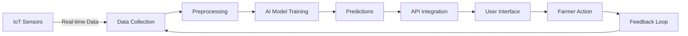

<div align="center">

# 🌾 Krishi Deep

### *Empowering Farmers Through Intelligence*

[](https://vitish.in)
[](https://github.com)
[](https://github.com)

**AI-Powered Smart Farming Platform for the Modern Farmer**

[Features](#-key-features) • [Architecture](#-system-architecture) • [Tech Stack](#️-tech-stack) • [Getting Started](#-getting-started) • [Team](#-team)

</div>

---

## 📋 Problem Statement

**Problem ID:** `25030`  
**Title:** AI-Based Crop Recommendation for Farmers  
**Theme:** Agriculture, FoodTech & Rural Development  
**Category:** Software

> *How can we leverage AI and IoT to transform traditional farming into data-driven agriculture, helping farmers make informed decisions and maximize yields?*

---

## 💡 What is Krishi Deep?

**Krishi Deep** (meaning "Agricultural Light") is a revolutionary smart-farming platform that bridges the gap between traditional agriculture and cutting-edge technology. We empower farmers with:

- 📊 **Real-time environmental monitoring** through IoT sensors
- 🤖 **Intelligent crop recommendations** powered by AI/ML
- 🔗 **Transparent market pricing** secured by blockchain
- 📱 **Easy-to-use mobile and web interfaces** in local languages
- 🌐 **Offline-first design** for rural connectivity challenges

Our mission is simple: **Make every farmer a data-informed decision maker.**

---

## ✨ Key Features

<table>
<tr>
<td width="50%">

### 🌱 Smart IoT Integration
Real-time monitoring of:
- Soil moisture levels
- Temperature & humidity
- pH and nutrient content
- Environmental conditions

</td>
<td width="50%">

### 🤖 AI-Driven Insights
Intelligent predictions for:
- Optimal crop selection
- Disease detection & prevention
- Yield forecasting
- Market price trends

</td>
</tr>
<tr>
<td width="50%">

### 🔗 Blockchain Transparency
Secure and tamper-proof:
- Market price records
- Transaction history
- Supply chain tracking
- Fair trade verification

</td>
<td width="50%">

### 📱 Multi-Platform Access
Available on:
- Mobile app (Android & iOS)
- Web dashboard
- Offline mode support
- Multi-language interface

</td>
</tr>
<tr>
<td width="50%">

### 💬 Interactive Assistant
Personal farming guide with:
- Local language support
- Voice-based queries
- Step-by-step guidance
- 24/7 availability

</td>
<td width="50%">

### 🔔 Smart Alerts
Real-time notifications for:
- Crop health warnings
- Weather forecasts
- Price fluctuations
- Irrigation reminders

</td>
</tr>
</table>

---

## 🏗️ System Architecture

```
┌─────────────────────────────────────────────────────────────────┐
│                          User Layer                              │
│  ┌──────────────────┐              ┌──────────────────┐         │
│  │   Mobile App     │              │   Web Dashboard  │         │
│  │   (Flutter)      │              │   (ReactJS)      │         │
│  └────────┬─────────┘              └────────┬─────────┘         │
└───────────┼──────────────────────────────────┼──────────────────┘
            │                                  │
            └──────────────┬───────────────────┘
                           │
┌──────────────────────────▼───────────────────────────────────────┐
│                      API Gateway Layer                            │
│                      (FastAPI)                                    │
└──────────────────────────┬───────────────────────────────────────┘
                           │
            ┌──────────────┼──────────────┐
            │              │              │
┌───────────▼────┐  ┌──────▼──────┐  ┌───▼──────────┐
│   AI/ML Models │  │  Blockchain │  │  IoT Gateway │
│                │  │    Layer    │  │              │
│ • XGBoost      │  │             │  │ • ESP32      │
│ • LSTM         │  │ • Docker    │  │ • DHT22      │
│ • Random Forest│  │ • Hashlib   │  │ • Sensors    │
└────────┬───────┘  └──────┬──────┘  └───┬──────────┘
         │                 │             │
         └────────┬────────┴─────────────┘
                  │
         ┌────────▼─────────┐
         │   Data Layer     │
         │                  │
         │ • MongoDB        │
         │ • Firebase       │
         └──────────────────┘
```

---

## 🛠️ Tech Stack

### Frontend Development


### Backend & AI/ML


### Database & Cloud


### IoT & Hardware


### Blockchain


---

## 🔬 Methodology



### Step-by-Step Process

1. **📡 Data Collection** - IoT sensors continuously monitor soil and environmental parameters
2. **🧹 Preprocessing** - Raw data is cleaned, normalized, and stored in MongoDB
3. **🧠 Model Training** - ML algorithms learn patterns from historical and real-time data
4. **🎯 Prediction** - AI models generate crop recommendations and forecasts
5. **🔐 Blockchain Verification** - Market data is secured on blockchain for transparency
6. **📱 Delivery** - Insights delivered through intuitive mobile and web interfaces
7. **🔄 Continuous Learning** - User feedback improves model accuracy over time

---

## 💰 Business Model

| Revenue Stream | Description | Target Audience |
|----------------|-------------|-----------------|
| **🛒 E-Commerce Marketplace** | Commission on sales of seeds, fertilizers, and farming equipment | Farmers & Suppliers |
| **💎 Premium Subscriptions** | Advanced AI features, detailed analytics, and priority support | Progressive Farmers |
| **📢 Sponsored Recommendations** | Featured products and brand partnerships | Agri-businesses |
| **🏛️ Government Partnerships** | Integration with subsidy schemes and rural development programs | Public Sector |
| **📊 Data Analytics** | Aggregated market insights (anonymized) | Research Institutions |

---

## 🌍 Impact & Benefits

### 💵 Economic Impact
- Increase farmer income by **20-30%** through optimized crop selection
- Reduce input costs by **15-25%** with precise resource management
- Access to fair market prices eliminates middleman exploitation

### 📚 Educational Empowerment
- Digital literacy programs for rural farmers
- Knowledge sharing through community features
- Best practices from successful farmers

### 🌱 Environmental Sustainability
- Optimized water usage reduces wastage by **30%**
- Precise fertilizer application minimizes soil degradation
- Promotes organic farming through AI-driven recommendations

### 👥 Social Transformation
- Empowers small-scale and marginalized farmers
- Bridges urban-rural digital divide
- Creates community support networks

### 🏥 Food Security & Health
- Early disease detection prevents crop loss
- Improves food quality and safety
- Ensures consistent supply chain

---

## 📚 Research & References

- **ICAR** - Smart Farming and Digital Agriculture in India
- **Ministry of Agriculture & Farmers Welfare** - Digital Agriculture Mission 2021-2025
- **NITI Aayog & IBM (2019)** - AI in Indian Agriculture: Crop Yield Prediction & Advisory Systems
- **Springer (2020)** - IoT Applications in Precision Farming
- **OpenWeatherMap API** - [Weather Data Integration](https://openweathermap.org/api)

---

## 🚀 Getting Started

### Prerequisites
```bash
# Required Software
- Node.js (v14+)
- Python (v3.8+)
- MongoDB
- Git
```

### Installation

**1. Clone the Repository**
```bash
git clone https://github.com/your-username/KrishiDeep.git
cd KrishiDeep
```

**2. Backend Setup**
```bash
cd backend
pip install -r requirements.txt
uvicorn main:app --reload --host 0.0.0.0 --port 8000
```

**3. Frontend Setup**
```bash
cd frontend
npm install
npm start
```

**4. Mobile App Setup**
```bash
cd mobile
flutter pub get
flutter run
```

**5. IoT Configuration**
- Upload Arduino sketch to ESP32
- Configure WiFi credentials
- Set up sensor calibration

---

## 👥 Team

<div align="center">

### 🌾 Team Krishi Deep | VIT-229

</div>

| 👤 Member | 🎯 Role | 🔗 Expertise |
|-----------|---------|--------------|
| **Dipsita** *(Team Leader)* | ML & Backend Integration | Machine Learning, System Architecture |
| **Shreyash Gautam** | Full-Stack Developer & Data Analyst | ReactJS, Python, Data Analysis |
| **Siddharth** | AI/ML Engineer | Deep Learning, Model Optimization |
| **Adaysha** | IoT Developer | ESP32, Sensor Integration, Arduino |
| **Nikhil** | Blockchain & Cloud Integration | Docker, Distributed Systems |
| **Yash** | Mobile App & UI/UX Designer | Flutter, User Experience Design |

---

## 📄 License

This project is licensed under the MIT License - see the [LICENSE](LICENSE) file for details.

---

## 🙏 Acknowledgments

Special thanks to:
- **VIT Chennai** for hosting VITISH 2025
- **ICAR** and **Ministry of Agriculture** for research insights
- All farmers who provided valuable feedback during development
- Open-source community for amazing tools and libraries

---

<div align="center">

### 🌾 *Sowing Seeds of Smart Farming* 🌾

**Made with ❤️ by Team Krishi Deep**

[](https://github.com)
[](https://demo.com)
[](https://docs.com)

</div>